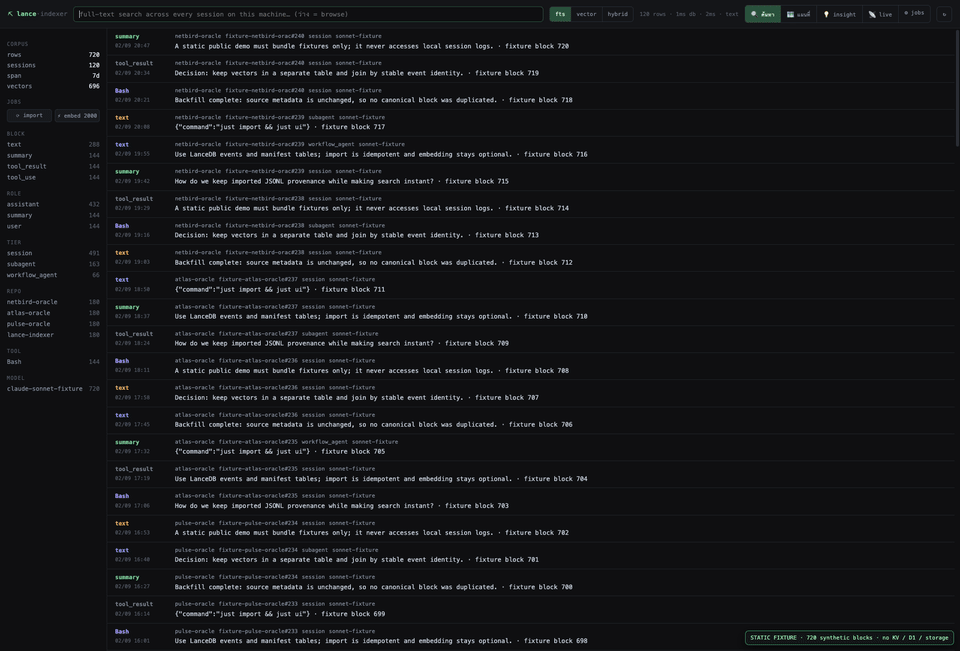
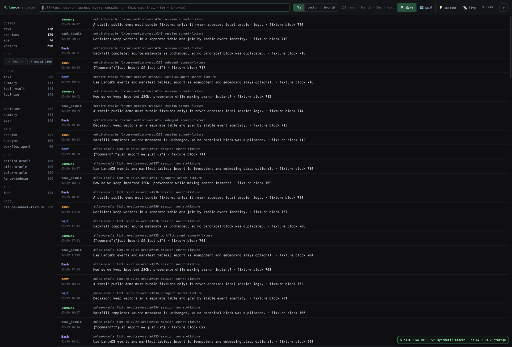
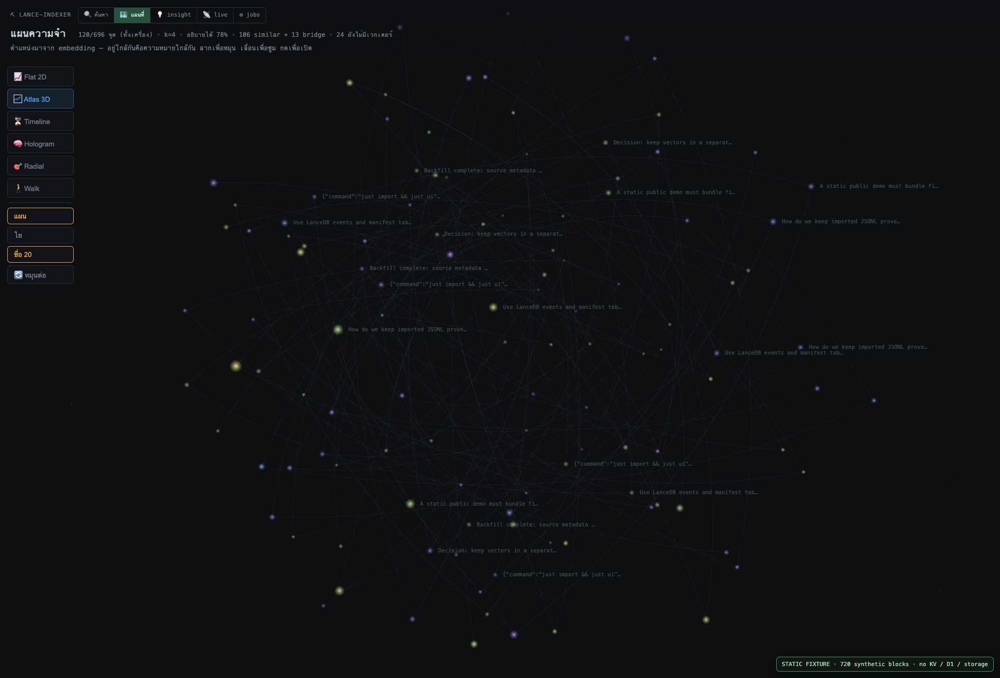
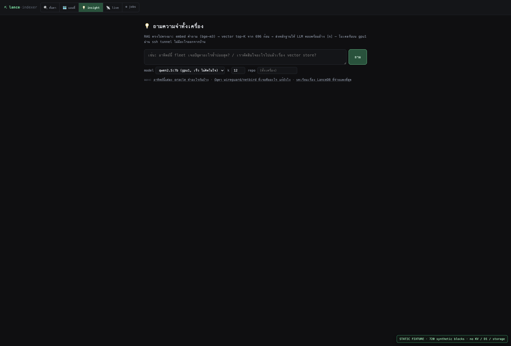
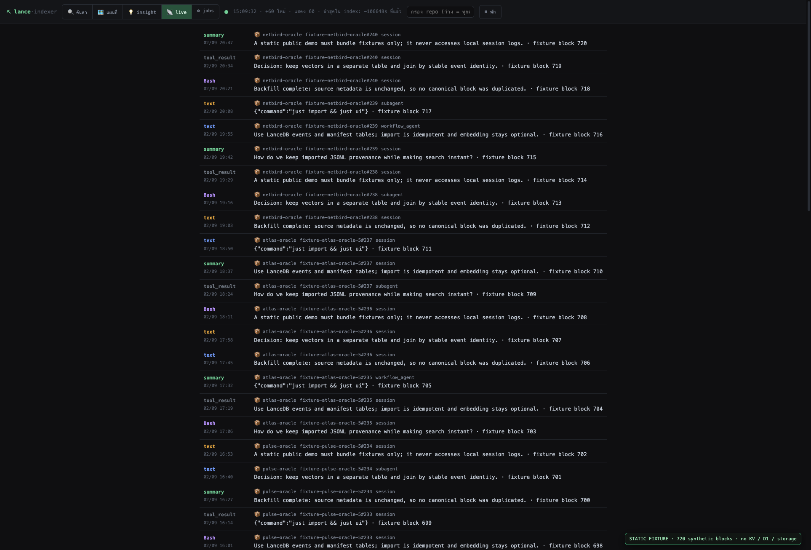
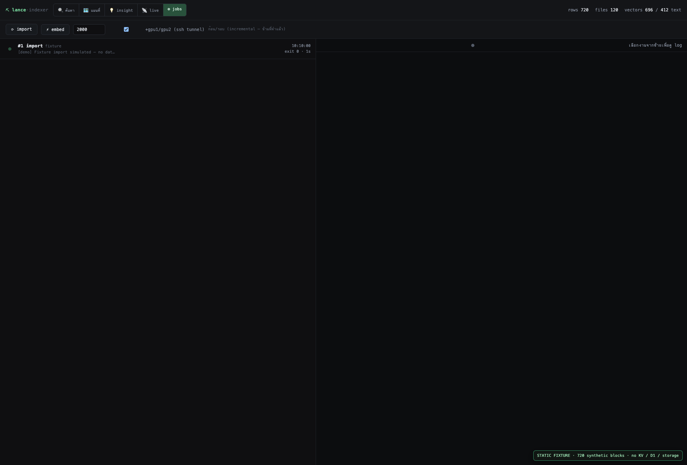

# Lance Indexer

> A local-first LanceDB indexer for Claude Code JSONL, with block-level search,
> provenance drill-down, live intake, RAG evidence, and a pluggable vector map.

**[Open the public static fixture demo](https://lance-indexer-fixture-demo.laris.workers.dev/)**



The animated overview above cycles through every public screen (two seconds per
screen); the full-size stills are shown below.

The public demo is the real browser UI with **720 bundled synthetic blocks**.
It has no KV, D1, R2, database binding, filesystem access, secret, telemetry,
or persistence. Import and embedding controls are deterministic simulations.

## Local engine

The local tool owns three LanceDB tables:

| Table | Purpose |
| --- | --- |
| `events` | Content blocks normalized from JSONL with stable IDs |
| `files` | Source-file manifest for idempotent backfill |
| `vectors` | Optional embeddings, added after import |

Import does not contact an embedding model. Vectors are a separate, optional
table keyed by canonical event ID.

```bash
just import       # local JSONL → LanceDB; repeat safely
just ui           # http://127.0.0.1:4131
just embed 300    # explicit incremental embedding
just compare      # compare against the companion FTS proof
just test         # run the whole test suite
just teardown     # remove only this lab's .data/
```

`scripts/import.ts` defaults to `~/.claude/projects`; it is a **local-only**
command. Never deploy a local database or real session files.

## Browser surfaces

- **Search** — lexical, vector, and hybrid block search with facets.
- **Map** — PCA projection, mutual kNN links, MST bridges, visualization plugins.
- **Insight** — evidence-first RAG against the local vector table.
- **Live** — a bounded recent block feed.
- **Jobs** — stdout-backed import/embed activity and preflight counts.

## Public fixture deployment

`worker/index.ts` is deliberately an API-shaped mock of `scripts/ui.ts`:
it returns the same public response shapes for all UI screens while reading
only deterministic in-module fixtures. `wrangler.toml` declares one binding:
static `ASSETS` from `ui/`.

## Public demo — every screen

These screenshots are rendered **directly in this README**; no click-through is
needed. They were captured from the deployed static fixture demo, whose records
are all deterministic synthetic data.

### Search


### Vector map


### Insight


### Live intake


### Jobs


For accompanying captions and the deployment boundary, see
[docs/public-demo-gallery.md](docs/public-demo-gallery.md). For real local
JSONL ingestion, read [HOW-IT-WORKS.md](HOW-IT-WORKS.md).

## Privacy

- `.data/`, `scripts/node_modules/`, generated locks, and screenshots from a
  personal corpus are ignored.
- This repository must contain source code and synthetic fixtures only.
- Do not commit JSONL sessions, API keys, SSH destinations, or vector stores.

## License

[MIT](LICENSE) © 2026 Soul Brews Studio.
